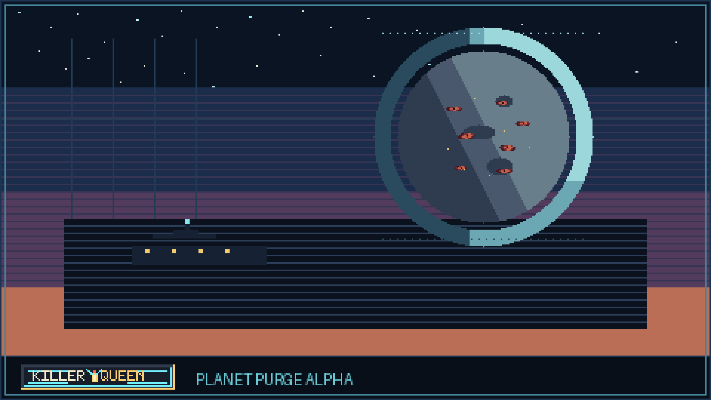

# Killer Queen



Killer Queen is a Godot action-platformer about jet-powered ascent, starter-weapon rivalry, and cutting a path out of a dying hive-city.

Play the current build on itch.io: [zwin-ux.itch.io/killer-queen](https://zwin-ux.itch.io/killer-queen)

The current build is a playable opening slice:
- choose `Service Fang` or `Dock Blaster`
- break out of the dock
- climb the first shaft
- duel the rival hunter in the cave
- salvage the damaged opposite starter and push toward the mountain route

## Run The Project

Requirements:
- Godot `4.6.1` or newer

Quick start:
1. Open the project in Godot.
2. Run `scenes/main_menu.tscn` for the front door.
3. Run `scenes/main.tscn` if you want the gameplay slice directly.

## Replit / GitHub Import

This repo is prepared for Replit import from GitHub. Replit is best used here for code edits, Git sync, AI-assisted scripting, and headless health checks. Use desktop Godot for scene editing, tilemaps, animation setup, import settings, and final export review.

Replit Run button:

```bash
bash tools/replit_health_check.sh
```

Optional web export helper, after adding a Godot export preset named `Web`:

```bash
bash tools/replit_export_web.sh
```

Full setup notes: [docs/setup/REPLIT.md](docs/setup/REPLIT.md)

## Repo Layout

- `scenes/` playable scenes and UI surfaces
- `scripts/` gameplay, UI, rendering, and state logic
- `art/source/` Aseprite-first source art and production docs
- `art/export/` runtime sprite sheets and generated exports
- `docs/` design, art, and planning notes
- `tools/` content generators, exporters, and build helpers
- `release/` packaging and storefront assets

## Contributing

This repo is being set up for real open development. Good contributions right now:
- combat feel and movement tuning
- player, rival, and environment sprite cleanup
- readability and UI polish
- encounter tuning, bug fixes, and performance cleanup
- documentation that helps contributors ship faster

Read [CONTRIBUTING.md](CONTRIBUTING.md) before opening a larger pull request.

## Key Docs

- [Docs Index](docs/README.md)
- [Game Direction](docs/game/DESIGN.md)
- [Opening Slice](docs/game/FIRST-VERTICAL-SLICE.md)
- [Rival Boss](docs/game/STARTER-RIVAL-BOSS.md)
- [Pixel Art Bar](docs/art/PIXEL-ART-FUNDAMENTALS.md)

## Asset Workflow

- Source art lives in `art/source`
- Exported runtime sheets live in `art/export`
- Batch export runs through `tools/export_aseprite.ps1`

## Open Source Direction

Issues and pull requests are welcome. Keep them small, testable, and aligned with the game's tone. This project gets better through stronger feel, clearer visuals, and cleaner staging, not through scope spam.
